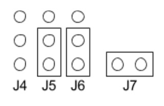

## Enable PORTA Configuration to BT-Module
To change any settings on the BT [module](doc/HC05BT.pdf) (using the 2.5mm cable) change the jumpers to the following, you will likley need to source 1 "pc"-jumper for this task as not all shipped have 3 jumpers installed.



- ***NOTE*** I have experienced failures of the MAX232 Chip and recommend having spares for this hardware its on a DIP socket for a reason. Be cautious to use ESD protection and make sure power is not connected when modifying these jumpers.

Set up a terminal-emulator at 19200 on your PC, With MTT4BT power off, remove the J7 jumper shunt, power the MTT4BT, then place the J7 jumper shunt on the J7 header pins. 

In the terminal-emulator console enter `​AT` and press enter, and the module should respond with `O​K` ​If it does not, check that the terminal is sending CR/LF when enter is pressed. It may be possible that the baud rate is 38400 or 9600, or 4800 so also try those if you don't connect.

You can copy and paste the following, full block to "reset" your module to Byonics default config. Paste into your terminal-emulator. if you really mess up `AT+ORGL` will reset to 38400 baud and then past the following..

```
AT+NAME=MTT4BT
AT+PSWD=1234
AT+ADDR?
AT+UART:19200,1,0
```
additionally you can send from linux CLI
```
echo -e "AT+UART:19200,1,0\r" | picocom -b 38400 -qrx 1000 /dev/ttyUSB0
```
now, return to normal mode, remove J7 jumper shunt reset to the shown [BT-PORTA](https://github.com/SpudGunMan/MicroTrak-MTT4B-mods#port-a-bluetooth) mode after configuring. And [connect](#connecting-bluetooth)!

### Partial list of HC-05 AT command table
| AT Command | Description |
| --- | --- |
|`AT+ORGL`|Slave mode, pin code :1234, device name: H-C-2010-06-01 ,Baud 38400
|`AT+UART?`|Read the current serial configuration
|`AT+UART:19200,1,0`|Set the serial configuration to 19200 baud, 1 stop bit, no parity
|`AT+NAME?`|Read the current device name
|`AT+PSWD?`|Read the current connection PIN/password
|`AT+RESET`|Reset
|`AT+VERSION?`|Version information
|`AT+ADDR?`|Bluetooth address: NAP: UAP : LAP
|`AT+ROLE?`|Check module mode, set with `AT+ROLE=` 0-slave 1-master 2-slaveloop
|`AT+CLASS?`|Check device class set with `AT+CLASS=`
|`AT+INQM?`|Check Query access patterns
|`AT+CMODE`|Check connect mode set with `AT+CMODE=` 0-connect fixed 1-connect any
|`AT+BIND?`|Check fixed address set with `AT+BIND=` 00:00:00:00:00:00
|`AT+IPSCAN?`|Check scan parameter
|`AT+SNIFF?`|Check SNIFF parameter
|`AT+RMAAD`|Delete All Authenticated Device
|`AT+ADCN?`|Get Authenticated Device Count
|`AT+MRAD?`|Most Recently Used Authenticated Device
|`AT+STATE?`|Get the module working state

remember to return to normal mode, reset to the shown [BT-PORTA](https://github.com/SpudGunMan/MicroTrak-MTT4B-mods#port-a-bluetooth) mode after configuring.
