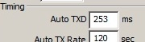
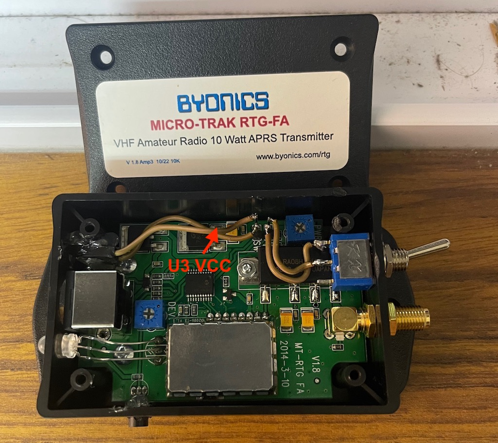

# Micro­Trak RTG -FA
Micro­Trak RTG APRS tracker/Beacon hardware. The MicroTrak tracker line combines the TinyTrak controller with a supplied GPS and built in 10-watt frequency agile VFO / 2-meter (144 MHz - 148 MHz)transmitter. built in telemetry support to transmit supply voltage and temperature more details here..

## Getting Started

### GPS
Likely best to buy the one they sell (of which there are two, mentions one has better altimeter screen printed on top visually) its a very nice [chip](https://www.mouser.com/new/lantronix/lantronix-sirfstar-iv-modules/). The MicroTrak's requires 'serial standard NEMA', not newer chip/sentences, they have a GUA cable or a USB to GPS cable to power the  factory GPS directly to PC which is recommended for using a pi to fiddle with the data, watch your port current a hub is recommended. The factory chip is fast and has nice boot-up includes some fancy technology.

### Connections power and serial
The other item to be sure to have is cables TT-USB and a PP-RTG /+null one or all three (usb/serial+null) are needed.
 - Byonics' adds 5v to the DB9 ports for the GPS and this is used by the TT-USB as well to power the device while programming. To keep this isolated recommend using the manufacture cables which are all labeled.
 - You can use the PP-RTG with your own injected ~8v/12v and a null modem cable or adapter to your computer serial. If you power it to 12v ***have a RF load connected.***
 - You can use the TT-USB to the device directly nothing else needed, watch your port current, suggest a hub.

 ### Connection antenna
 The full ready to go kit, includes a mag-mount, SMA-M 2m antenna with about 6 foot of coax. The antenna will likely be damaged in shipping and its base can use a spot of gorilla glue, as it will break. It works, its retail-shipped price is around $30 in 2022-USD, to be clear..  its a $5 antenna you will use for too long, or never. They also sell a v6 dipole that is about the size of your hand. I wouldn't recommend, use your own mag-mount or ladder J-pole for terrestrial work. the stuff they up-sell works but its not worth the value long term. Antenna is not Wx rated at all, don't leave in rain, at minimal crack open the base, and fill it with glue to waterproof this cavity and keep magnet inside.

 ## Reading material beyond here

The [Manual](doc/MicroTrak_RTG_FA_Manual_v1.8-2.pdf) describes the hardware and firmware functions.

The [Config Manual](doc/TinyTrak3_Config_Manual_v1.4.pdf) is also mandatory to review as it has lots of nerdy bits 'the advanced manual.'
- A difference shipped device has the following autoTXD changes as defaults
- 

NOTE the TinyTrak3Config v1.4.6.exe tool works under wine, additionally with box86 it works on raspberry-pi4 wine. It appears COM port mapping might need work as no ports are found however.. need to test more.

## Quick Setup

Following is for temp return in F
```
PARM.Battery,Temp
UNIT.Volts,Deg.F
EQNS.0,0.0293,0,0,0.879,-­459.67
```
Following for temp return in C
```
PARM.Battery,Temp
UNIT.Volts,Deg.C
EQNS.0,0.0293,0,0,0.489,-­273.15
```

enter the data into [findu entermsg tool](http://www.findu.com/cgi­bin/entermsg.cgi)
- I have found issues with the EQNS, I cant send it to myself like the manual shows.
  - If using a SSID it works FROM TO cant be the same call possibly?
    - so if your device is programed for N0CALL-4 you want to send from NOCALL-1 
  - if you mess up send the same VAR into the message tool (PARM,UNIT,EQNS)

## backup default device
 - Recommend a read config, a save config and set that .tt3 file to readonly status. This way you have a safe default copy. 
 - now when changes are made pressing save will ask what to save new file and not your default!

# Advanced modding


The newest RTG's ( made in the last few years and having an SMD PIC, have 20 pin devices. The older units use an 18 pin DIP PIC, so you need to make sure you are looking at schematics for the current version, V1.8. On this board, the PCB silkscreen "T" and the SW" are backwards..that is to say, next to the wrong inputs. "SW" is actually the 0-5 Volt analog input, and "T" is for an external profile switch to select one of two configurations. 

 photo here shows functioning connections to the hardware recieved nov-2022. jumpers used to extend the telemetry port externally when used.

## Adding sensors

### VCC
Tap +5vcc directly off the 5 Volt regulator's U3 output pin PIN3. (***Note*** that there is a 12 Volt regulator too...don't tap that one!!) it is not recommended to use the DB9 GPS power.

### SIGnal
Again note, the T and S markings are reversed, so "S screen-print" is for the telemetry input. S is for switch see photo above and notice where the wires travel to make this clear. 
- There is a ground connection at 2mm spacing. 
- We will call it the T/telemetry line and not reference the screen-prints.

This telemetry line feeds the device (PIC/RB6/13 "pin11") analog 5vREF, PULL-UP

Being a ***pull-up*** we also need to reference to the vcc and we additionally want some protection on this Signal for current limiting. 

Depending on your sensor this varies the temp sensors for example are using a 2.2k resistor, and the volts are using a 2.2k resistor calculations are needed for this resistor.

### GND
There is a ground connection at 2mm spacing headers, this is uncommon spacing.

## CDS Photo Sensor
Example of a simple and fun addition to the device.


TODO: show EQNS

## Software changes

These are recommended changes to make to the default config as shipped. 

NOTE the TinyTrak3Config v1.4.6.exe tool works under wine, additionally with box86 it works on raspberry-pi4 wine. It appears COM port mapping might need work as no ports are found however.. need to test more.

 - UART enable
   - Allow TTL Serial, enable to have easy interface with raspberry pi GPIO or similar.
 - Switch for profiles, make a 2nd one..
   - see photo for switch mounting idea
 - 3rd Telemetry input
    - make sure to click edit telemetry and you can
    - Set up auto telemetry reporting (aka not use the findu.cgi over the air) by clicking the edit telemetry button
    - Change channels
      - 1 supply voltage, sampled from PIC RB4/11 "pin7"
      - 2 LM-335 temp sampled from PIC RB2/9 "pin8"
      - 3 "T" PCB pin-header (2mm pitch), sampled from PIC ~~RB5/12~~ RB6/13 "pin11"
    - Definition Rate 0 assume is off??

### The Telemetry Definition Text
allows telemetry definitions to be sent regularly to describe and adjust the telemetry reports
    - can we send other data/msg...??

Following is for temp return in F added the additional sensor into battery2 as voltage, this is entered directly into the GUI edit telemetry window. Change my call to the SSID that your profile is using

This is hard set and replaces the data on aprs.fi its preferred to keep it in the cloud typically..

**before you do any of this, remember that the PIC is 5v and this is a unprotected line**

```
:MYCALL   :PARM.Battery,Temp,Battery2
:MYCALL   :UNIT.Volts,Deg.F,Volts
:MYCALL   :EQNS.0,0.0293,0,0,0.879,-­459.67,0,0.0293
:MYCALL   :BITS.00000000,TinyTrak

```
 - MYCALL is the callsign of the tracker, padded with spaces to length 9. 
 - PARM line give a description of each telemetry channel
 - UNIT line gives a textual unit to describe each channel
 - EQNS line gives a A B, and C for each Analog channel (we have 3) 
   - EQNS. `Ax^2,Bx,C`  **,**  `Ax^2,Bx,C`   **,**  `Ax^2,Bx,C`
   - EQNS. `Volts`  **,**  `Deg`   **,**  `Chan3-AUX`
 - BITS line describes the digital telemetry (not used **but can we feed into PIC PIN-11**), followed by the project name for the telemetry or operation or kit

### The EQNS voltage
The volts `0,0.0293,0` is calculated in the following way. 

- Since the supply voltage is fed through a 10K & 2K voltage divider, the voltage presented to PIC
  - Input supply voltage (commonly 12v) passes the voltage divider 2K/(10K+2K) or 1/6 `0.0293` the supply voltage. 
  - The PIC analog read value is a number between 0 (for 0 volts) and 1023 resolution (for 5 volts PIC reference).
  - So the supply voltage can be found my multiplying the reported number, by 5V/1023*6 or 0.0293. 
    - Reverse: look at live telemetry data, volt packet might be `442` which 442*0.0293 displays Battery: 12.95v on aprs.fi
  - back to EQNS (Ax^2 + Bx + C). The first 3 numbers in the EQNS:
    - A = 0, B = 0.0293, and C = 0


APRS.org document snip with red text overlay showing this device values.

### The EQNS temp
The EQNS Temp `0,0.879,-­459.67`F or `0,0.489,-­273.15`C is calculated in the following way.

- The temperature sensor analog-8 reports 10mV / deg K, and deg F = deg K * 9/5 – 459.67
  - LM-355 voltage (5V/1023) / 0.01V multiplied by 9/5 = 0.879 then 459.67 is subtracted
- For Celsius, (deg C == deg K – 273.15) 
  - LM-355 voltage(5V/1023) / 0.01V = 0.489 and then 273.15 is subtracted.

### EQNS for cDs Light 

the scale is logarithmic, but the constants are Ax^2+Bx+C and impossible to align.

However, you could easily express the values in percent of full value.
  - So 0 bits = 0% and 1000 bits is 100%.
  - Although the data should never reach 1000 (highest is 999).
  - A3, B3, C3 would then be 0, 0.1, 0.

table (using 1000 instead of 999 for bit conversion):
|Volts ver div|bit size|display
|---|---|---|
|0.1V * 1000 / 5 |20 bits |applying the 0.1 gain = 2% Very dark
|1.0V * 1000 / 5 |200 bits|applying the 0.1 gain = 20%
|2.5V * 1000 / 5 |500 bits|applying the 0.1 gain = 50%
|4.0V * 1000 / 5 |800 bits|applying the 0.1 gain = 80%
|5.0V * 1000 / 5 |1000 bits|applying the 0.1 gain = 100% VERY BRIGHT!


## Notes
 - TinyTrak firmware takes in NMEA serial GPS data, and sends out APRS formatted position packets
 - WXTrak firmware takes in serial data from a weather station and sends out APRS weather packets
 - TinyPack firmware takes in any serial text terminated with carriage return, and sends that as a UI packet. It is used to do custom transmissions, plus works with the Davis weather stations that send out APRS strings natively.


# Reference material
T Packets https://aprs.fi/telemetry/a/N0CALL

16F1827 [PIC41391D](doc/41391D.pdf)

Wx serial [data](https://www.peetbros.com/shop/custom.aspx?recid=29)

todo: find serial specs for the WX200 / WM918

## Findu quick-links for scripting into automation
 - POST into `http://www.findu.com/cgi-bin/sendmsg.cgi?fromcall=N0CALL&tocall=N0CALL&msg=EQNS.0%2C0.0293%2C0%2C0%2C0.879%2C-459.67`
 - pre filled form `www.findu.com/cgi-bin/entermsg.cgi?fromcall=N0CALL-9&tocall=N0CALL`
 - sniff the db `http://www.findu.com/cgi-bin/msg.cgi?call=*`

More on EQNS on page 70 Telemetry starts a little back on 68 of the [APRS white-papers](http://www.aprs.org/doc/APRS101.PDF)

APRS Telemetry [note](http://he.fi/doc/aprs-base91-comment-telemetry.txt) for Base91 and aprs.fi telemetry

[aprs.fi](https://aprs.fi/doc/guide/aprsfi-telemetry.html) telemetry doc

[reference](https://github.com/PhirePhly/aprs_notes/blob/master/telemetry_format.md) on telemetry format

Bash telemetry blog posts
- https://s55ma.radioamater.si/2017/07/27/send-aprs-objects-or-telemetry-via-bash/
- https://s55ma.radioamater.si/2017/07/27/send-aprs-datatelemetry-via-xastir-command-line/


