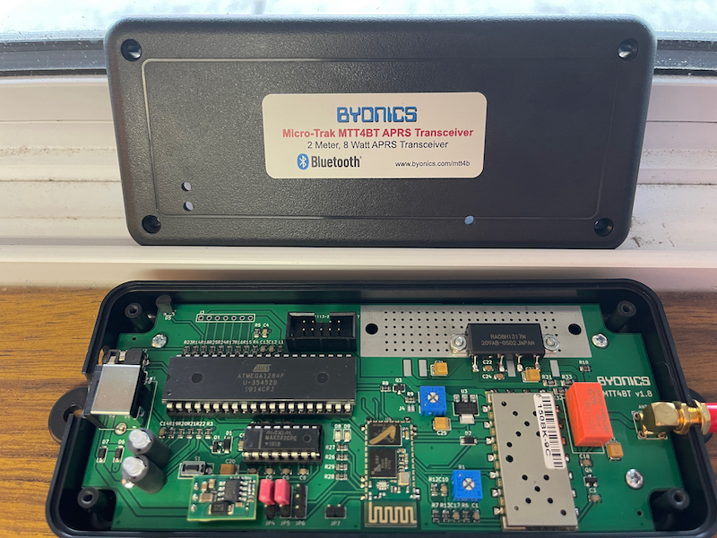

# Micro-TrakMTT4B-mods

MTT4BT, This MicroTrak tracker line combines the TinyTrak4 with an internal bluetooth module. With a supplied GPS and built in ~14-watt frequency agile VFO / 2-meter (144 MHz - 148 MHz)transmitter. its similar looking components to the [Micro-TrakRTGFA](https://github.com/SpudGunMan/Micro-TrakRTGFA-mods) for the RF deck, turned to '11' and the PIC, is a old friend the DIP ATMEGA128.

## Documentation
This device's manuals are much harder to focus on as it builds from years of the TT4 enhancment addons.
Kicking it off!

 - The [Manual](doc/MTT4B_Manual_v1.0.pdf) which has fuzzy Schematic's and hardware guide and a list of software commands, a [Mini Addendum](doc/MTT4B-Mini_Addendum.pdf) if you have the stamp sized version of the MTT4B. 

 - The [addendum](doc/MTT4BT_Manual_Addendum.pdf) has hardware configs and Bluetooth settings for the big version, which also references this BT chip, [HC05BT](doc/HC05BT.pdf). Also as well, the firmware [guide](doc/TinyTrak4_Firmware_Manual_v1.1.pdf) for flashing. And the tt4 firmware [manual](tt4/TinyTrak4_Alpha_Firmware_Manual_v0.72.pdf) with more details on software as well!

 - not done yet! next up is the extra stuff, the operation of the [display](tt4/tt4_display_v1.3.pdf) as well as wire [guide](tt4/tt4_display_wiring.pdf) for the tt4 but applied here as well.

 - after you consumed all that font forget the tt4 hardware [build](tt4/TinyTrak4_Built_Hardware_Manual_v8.pdf) for further details on the parts not covered in the others... whew!

-  Now that was a mouthfull and to say this github is a replacement for the tt4 Quick Start [Guide](tt4/TinyTrak4_Quick_Start_Guide_v0.7.pdf) I didnt mention yet is a understatment...

Truth be told the reason for this github is just sorting out the endless documentation I didnt want to do every time I try and change a setting...

### Ports

PORT B, the DB-9 connector on the power/serial cable, is generally used to connect a GPS.It is wired "backwards" in respect to a normal RS-232 connector, so you don't have to use a Null Modem adapter to connect a standard GPS receiver. In the default settings, it is set up as a 4800 Baud NMEA GPS. (All the ports on a TT4/MTT4 start up at 19200 and TEXT, and then switch to whatever else you may have set) 

The TT-USB cable will supply the 5 Volt power needed to light up the low power parts of an MTT4BT. This keeps you from having to connect it to external power and subsequently having to connect the unit to an antenna or dummy load. With the current generations of MTT4BT, you can configure the MTT4BT through this port using a serial terminal program ( The GUI TT4 config won't work) 

To connect through PORT A using a Byonics USB-25mm cable, you have to apply power to the MTT4BT. This can be done via the USB cable connected to PORT B, or external power. ( Don't blow up your transceiver please, use a dummy load  whenever you are using direct 12 Volt power) 

Note that +5 is also available on JP9. ( The square hole is positive, violating all laws of god and man) But I suggest avoiding that pin, since you may want to install a jack for use with a Byonics ( Or homemade) LCD/Keyboard display adapter. This adapter lets you send messages using a display and PS/2 keyboard, as well as changing most of the commonly used commands without having to connect to a PC. A warning note is that USB keyboards with a PS/2 adapter may or may not work ( Mostly not) You need a "real" ps/2 keyboard. 

### VCC, SIG, GND

RAW DATA NOTHING VERIVIED YET

MTT4BT, you can tap +5 from pin 2 of J3.  Pin 1, the square pad, is ground. Note that although it looks like this pin is connected through a limiting resistor, it is not, it is connected directly to the switched 5 Volt regulators output. The resistor connecting to it is the bias for D3, the LM335 Temperature sensor.

JP5 has Vcc (5V) coming through R7 (2.2k ohms), so current limited.

So by jumper-ing R7 and removing R12, you could have 5V on one side of JP5 and ground on the other.
That provides a 10-pin (2x5) connector for 4 sensors with grounds with signal and ground.
If you don't use more than 3 sensors, you can still use JP1 for bank switching.
Again, much easier to do on the KIT version.

It appears the MTT4B has a straight 7-pin header with Vcc, Ground, and the 5 analog input pins.
It does not appear to have the resistor on Vcc.
That would be even easier for analog inputs!

## Software
Device runs at 19200baud

The TEST44 is a bench-test ID entered during testing. If you did not request that Byon program your MTT4BT prior to shipping, it has that test callsign or the default NOCALL entered as callsigns entered in the main bank. 

 - The binary config [software](bin/TinyTrak4Config/TinyTrak4AlphaConfigv0.68.exe) is inside the Firmware v0.68.zip
 - Additionally you can just program like a classic TNC via text
   - config save files are just variable dump

### Firmware
Flashing is done via binary mode of a terminal emulator
 - Bootup into `b` boot loader
    - press `s` to start binary transfer
    - blink blink .........* finished old school stuff.

# Also See
Micro-TrakRTGFA [here](https://github.com/SpudGunMan/Micro-TrakRTGFA-mods)

# Recognition
Thanks to Rob KB8RCO and Allen AF6OF
