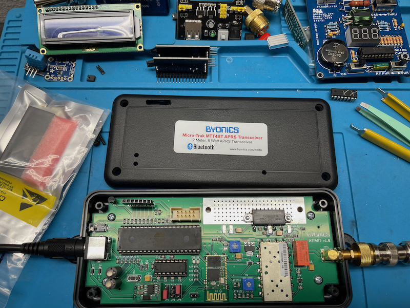
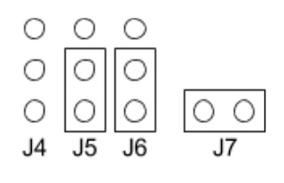

# Micro-TrakMTT4B-mods

MTT4BT, This MicroTrak tracker line combines the TinyTrak4 with an internal bluetooth module. With a supplied GPS and built in ~14-watt frequency agile VFO / 2-meter (144 MHz - 148 MHz)transmitter. its similar looking components to the [Micro-TrakRTGFA](https://github.com/SpudGunMan/Micro-TrakRTGFA-mods) for the RF deck, turned to '11' and the PIC, is a old friend the DIP ATMEGA128.



## Documentation
This device's manuals are much harder to focus on as it builds from years of the TT4 enhancment addons.
Kicking it off!

 - The [Manual](doc/MTT4B_Manual_v1.0.pdf) and hardware guide and a list of TNC commands, a [Mini Addendum](doc/MTT4B-Mini_Addendum.pdf) if you have the stamp sized version of the MTT4B. 

 - The [addendum](doc/MTT4BT_Manual_Addendum.pdf) has hardware configs and Bluetooth settings for the big version, which also references this BT chip, [HC05BT](doc/HC05BT.pdf). Also as well, the firmware [guide](doc/TinyTrak4_Firmware_Manual_v1.1.pdf) for flashing. And the tt4 firmware [manual](tt4/TinyTrak4_Alpha_Firmware_Manual_v0.72.pdf) with more details on software as well!

 - not done yet! next up is the extra stuff, the operation of the [display](tt4/tt4_display_v1.3.pdf) as well as wire [guide](tt4/tt4_display_wiring.pdf) for the tt4 but applied here as well.

 - after you consumed all that, dont forget the tt4 hardware [build](tt4/TinyTrak4_Built_Hardware_Manual_v8.pdf) and & MTT4B [Schematics](doc/MTT4BTv1.7Schematic.pdf) for further details on the parts not covered in the others... whew!

Now that was a mouthfull to say! not leaving out the TT4 Quick Start [Guide](tt4/TinyTrak4_Quick_Start_Guide_v0.7.pdf) and any aprs '101' EQNS and such.. compiled [here](https://github.com/SpudGunMan/Micro-TrakRTGFA-mods)

Truth be told the reason for this github is just sorting out the endless documentation I didnt want to do every time I try and change a setting...

In addition to the reading, make sure to buy the following cables, in addition to a GPS. (not included but, kinda needed)
- USB-25mm, and a TT-USB

Comes with a PP-RTG which a GPS or null modem PC will connect to. 
- PP-RTG cable which will connect 12v and GPS.
- See the [RTG](https://github.com/SpudGunMan/Micro-TrakRTGFA-mods#gps) for notes of GPS

The TNC commands available in the MTT4B are largely identical to the [commands](doc/MTT4B_Manual_v1.0.pdf) in the standard TT4. One major difference is that the transmit and receive frequency are set in software, and by default are both on 144.390 MHZ. You can have a split frequency or a simplex frequency without problems. To set the frequency from the command line of the TNC (text mode)
 - TXFREQ 144.390
 - RXFREQ 144.390

After you have made any changes, you can either type “quit”, recycle power, or push the reset button on the PC board inside the unit. Your changes will now be in effect.

# Ports

## PORT B, the DB-9 
The power/serial cable, is generally used to connect a GPS. It is wired "backwards" in respect to a normal RS-232 connector, so you don't have to use a Null Modem adapter to connect a standard GPS receiver. (like all devices)

- Typical settings, have PORT-B 4800 Baud NMEA GPS. 
- All the ports on a TT4/MTT4 start up at 19200 and TEXT, and then switch to whatever else you may have set
- The TT-USB cable will supply the 5 Volt power needed to light up the ATMEGA on the MTT4BT.
  - This keeps you from having to connect it to external power and subsequently having to connect the unit to an antenna or dummy load. 
  - With the current generations of MTT4BT, you can configure the MTT4BT through this port using a serial terminal program. 
  - The GUI TT4 config won't work per factory, but did on mine shipped unconfigured.

## PORT A, the 2.55mm headphone
Be sure to pick up a, not included, Byonics USB-25mm cable, which is also a kenwood/serial/usb 2.55mm compatable cable and likley a lot of others like radio shack etc..

- You have to apply power to the MTT4BT to use this port
  - This can be done via the TT-USB cable connected to PORT-B
  - PP-RTG cable via PORT-B 12v, Don't blow up your transceiver, use a RF load dummy; whenever using direct 12 Volt power
- Offical documentation states flash firmware with 2.55mm port
  - additionally needed for to access the BT module serial port.

## PORT A, Bluetooth

The MTT4BT makes PORT-A available either via (bluetooth OR 2.55mm stereo jack). 2.5mm jumpers on the MTT4BT PCB board select how PORTA is configured.

- Default jumpers set, PORT-A wired to the ATMEGA, and is identical to the original, non-­bluetooth version of the MTT4B
- Must change jumpers to change PORTA bnehavior (ATMEGA-serial or BT-serial)

The following image shows settings to enable the BT module. Open the device and change jumpers...


image shows settings to enable BT module as PORT-A detailed in the [addendum](doc/MTT4BT_Manual_Addendum.pdf), [more](https://github.com/SpudGunMan/MicroTrak-MTT4B-mods#enable-porta-configuration-to-bt-module) details below.

## HEADER for PS2, LCD
Byonics ( now discontinued selling ) has details you can make your own LCD/Keyboard display [adapter](tt4/tt4_display_wiring.pdf). This adapter lets you send messages using a display and PS/2 keyboard, as well as changing most of the commonly used commands without having to connect to a PC. 
 - Recomend a "real" ps/2 keyboard. 
 - uses serial data for LCD not I2C, make sure to have removable I2C daughterboard.

 

 LCD/PS2 Header, comes populated..

## Sensor VCC, SIG, GND
The MTT4B has two built in telemetry channels, one that reports the supply voltage to the unit, another, which reports the temperature inside the unit’s enclosure. Five additional telemetry channels are available for use ( PA3 through PA7 on J3) These inputs are capable of reading 0-5 Volt sensors and reporting the values over the APRS network.


JP3 Sensor Header, comes unpopulated, so you will need to add 2.5mm header pin's, included is 2.2k protection on each line.

VCC +5
- J3 Pin 2
- JP9 Header, Byonics suggests avoiding that header for sensor use, used for LCD/PS2

Ground
- J3 Pin 1

# Connecting Bluetooth
This section isnt done yet:

Needed packages on Raspian/Debian on a raspberry pi (default in new installs)

```
sudo apt-get install bluetooth bluez blueman
```
On the linux box, navigate to new bluetooth interface in menu bar. Turn MTT4B on with BT module jumpers [enabled](https://github.com/SpudGunMan/MicroTrak-MTT4B-mods#port-a-bluetooth) and make sure your HC-05 module is blinking red you should see a pair connection named MTT4BT on raspberry pi. Password is 1234
- Add new device, pair connection named MTT4BT on raspberry pi. 
- Password is 1234

If you see device, HC-05 the module may need programming see [more](https://github.com/SpudGunMan/MicroTrak-MTT4B-mods#enable-porta-configuration-to-bt-module) details below.

Shoud see a serial port which you can connect with TNC applications, depending on the mode of PORTA (KISS or TEXT) you can now access your TNC.

Example, Share TNC KISS via TCP, https://github.com/trasukg/share-tnc

# Hardware mods
I noticed on my new in box unit on inspection that the PCB had thermal discoloring from the RF power driver. I added a thermal tape and a passive cooling fins.


# Software
Device runs at 19200baud

The TEST44 is a bench-test ID entered during testing. If you did not request that Byon program your MTT4BT prior to shipping, it has that test callsign or the default NOCALL entered as callsigns entered in the main bank. 

 - The binary config [software](bin/TinyTrak4Config/TinyTrak4AlphaConfigv0.68.exe) is inside the Firmware v0.68.zip
 - Additionally you can just program like a classic TNC via text
   - config save files are just variable dump

## Firmware
Flashing is done via binary mode of a terminal emulator
 - Bootup into `b` boot loader
    - press `s` to start binary transfer
    - blink blink .........* finished old school stuff.

## Enable PORTA Configuration to BT-Module
To change any settings on the BT [module](doc/HC05BT.pdf) (using the 2.5mm cable) change the jumpers to the following..



Set up a terminal-emulator at 19200 on your PC, With MTT4BT power off, remove the J7 jumper shunt, power the MTT4BT, then place the J7 jumper shunt on the J7 header pins. 

In the terminal-emulator console enter `​AT` and press enter, and the module should respond with `O​K` ​If it does not, check that the terminal is sending CR/LF when enter is pressed. It may be possible that the baud rate is 38400 or 9600, or 4800 so also try those if you dont connect.

You can copy and paste the following, full block to "reset" your module to Byonics default config. Paste into your terminal-emulator. if you really mess up `AT+ORGL` will reset to 38400 baud and then past the following..

```
AT+NAME=MTT4BT
AT+PSWD=1234
AT+ADDR?
AT+UART:19200,1,0
```

additionally you can send from linux CLI
```
echo -e "AT+UART:19200,1,0\r" | picocom -b 38400 -qrx 1000 /dev/ttyUSB0
```

now, return to normal mode, remove J7 jumper shunt reset to the shown [BT-PORTA](https://github.com/SpudGunMan/MicroTrak-MTT4B-mods#port-a-bluetooth) mode after configuring.

### Partial list of AT command table
| AT Command | Description |
| --- | --- |
|`AT+ORGL`|Slave mode, pin code :1234, device name: H-C-2010-06-01 ,Baud 38400
|`AT+UART?`|Read the current serial configuration
|`AT+UART:19200,1,0`|Set the serial configuration to 19200 baud, 1 stop bit, no parity
|`AT+NAME?`|Read the current device name
|`AT+PSWD?`|Read the current connection PIN/password
|`AT+RESET`|Reset
|`AT+VERSION?`|Version infromation
|`AT+ADDR?`|Bluetooth address: NAP: UAP : LAP
|`AT+ROLE?`|Check module mode, set with `AT+ROLE=` 0-slave 1-master 2-slaveloop
|`AT+CLASS?`|Check device class set with `AT+CLASS=`
|`AT+INQM?`|Check Query access patterns
|`AT+CMODE`|Check connect mode set with `AT+CMODE=` 0-connect fixed 1-connect any
|`AT+BIND?`|Check fixed address set with `AT+BIND=` 00:00:00:00:00:00
|`AT+IPSCAN?`|Check scan parameter
|`AT+SNIFF?`|Check SNIFF parameter
|`AT+RMAAD`|Delete All Authenticated Device
|`AT+ADCN?`|Get Authenticated Device Count
|`AT+MRAD?`|Most Recently Used Authenticated Device
|`AT+STATE?`|Get the module working state

remember to return to normal mode, reset to the shown [BT-PORTA](https://github.com/SpudGunMan/MicroTrak-MTT4B-mods#port-a-bluetooth) mode after configuring.

# References
 - http://aprs.org/satt4.html
 - https://opensource.com/article/18/3/how-configure-aprs-igate-raspberry-pi
 - https://github.com/trasukg/share-tnc
 - [Micro-TrakRTGFA](https://github.com/SpudGunMan/Micro-TrakRTGFA-mods)

# Recognition
Thanks to Rob KB8RCO and Allen AF6OF
