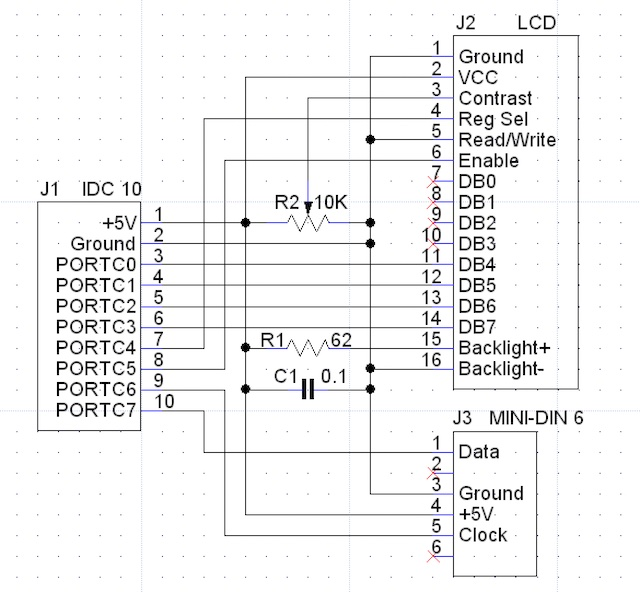

# Micro-Trak MTT4/BT/FA-mods


MTT4BT-FA, This MicroTrak tracker line combines the TinyTrak4 with an internal bluetooth module. With a supplied GPS and built in ~14-watt frequency agile VFO / 2-meter (144 MHz - 148 MHz)transmitter. its similar looking components to the [Micro-Trak RTG FA](https://github.com/SpudGunMan/Micro-TrakRTGFA-mods), turned to '11' and the PIC, is a old friend the DIP ATMEGA128.


## Cables
Before powering the unit, I recommend pulling it out and inspecting all solder joints, proper DIP orientation, and board work before you play. Pay special attention to the bluetooth module via/headers.

make sure to buy the following cables, in addition to a GPS. (not included but, kinda needed)
- USB-25mm, and a TT-USB

Comes with a PP-RTG which a GPS or null modem PC will connect to. 
- PP-RTG cable which will connect 12v and GPS.
- See the [RTG](https://github.com/SpudGunMan/Micro-TrakRTGFA-mods#gps) for notes of GPS

## QuickStart
TT4 Quick Start [Guide](tt4/TinyTrak4_Quick_Start_Guide_v0.7.pdf) has the best where to start. This document builds on the little brother [Micro-Trak RTG](https://github.com/SpudGunMan/Micro-TrakRTGFA-mods) be sure to review it for foundational not covered here, covers the basics of sensors and Telemetry feeds to aprs.fi. As well as quick starts for setting those parts up. This document will focus more on the TNC aspects and added hardware i/o

if you have the TT-25 and/or TT-USB cables and jump down to [Connecting](#connecting-via-serial) otherwise skip a section down to [Ports](#ports) to figure out how to connect.

### LED Indicators
On application of 6-12v there is a green and red stand-off LED's which will alternate twice, the red LED is a CPU running watchdog and TX/PTT indicator along with audible relay click, the Yellow is RX traffic. The green is GPS status: blink acquire, locked solid. Additionally with the cover off is D8 and D9, showing HC-05 BT Module LED.

## Documentation
This device's manuals are a bit thick, as they build from years of the TT4 enhancement add-ons.

 - The [Manual](doc/MTT4B_Manual_v1.0.pdf) and hardware guide and a list of TNC commands, a [Mini Addendum](doc/MTT4B-Mini_Addendum.pdf) if you have the stamp sized version of the MTT4B. 

 - The [addendum](doc/MTT4BT_Manual_Addendum.pdf) has hardware configs and Bluetooth settings for the big version, which also references this BT chip, [HC05BT](doc/HC05BT.pdf). Also as well, the firmware [guide](doc/TinyTrak4_Firmware_Manual_v1.1.pdf) for flashing. And the tt4 firmware [manual](tt4/TinyTrak4_Alpha_Firmware_Manual_v0.72.pdf) with more details on software as well!

 - not done yet! next up is the extra stuff, the operation of (but otherwise different hardware) the [display](tt4/tt4_display_v1.3.pdf) as well as wire [guide](tt4/tt4_display_wiring.pdf) applied here as well.

 - after you consumed all that, don't forget the tt4 hardware [build](tt4/TinyTrak4_Built_Hardware_Manual_v8.pdf) and & MTT4B [Schematics](doc/MTT4BTv1.7Schematic.pdf) for further details on the parts not covered in the others... whew!

# Ports

## PORT B, the DB-9 
The power/serial cable, is generally used to connect a GPS. It is wired "backwards" in respect to a normal RS-232 connector, so you don't have to use a Null Modem adapter to connect a standard GPS receiver. (like all devices)

- Typical settings, have PORT-B 4800 Baud NMEA GPS. 
- All the ports on a TT4/MTT4 start up at 19200 and TEXT, and then switch to whatever else you may have set
- The TT-USB cable will supply the 5 Volt power needed to light up the ATMEGA on the MTT4BT.
  - This keeps you from having to connect it to external power and subsequently having to connect the unit to an antenna or dummy load. 
  - With the current generations of MTT4BT, you can configure the MTT4BT through this port using a serial terminal program. 
  - The GUI TT4 config won't work per factory, but did on mine shipped un-configured.

## PORT A, the 2.5mm Sub-Mini headphone
Be sure to pick up a, not included, Byonics USB-25mm cable, which is also a kenwood/serial/usb 2.5mm compatible cable and likely a lot of others like radio shack etc..

- You have to apply power to the MTT4BT to use this port
  - This can be done via the TT-USB cable connected to PORT-B
  - PP-RTG cable via PORT-B 12v, Don't blow up your transceiver, use a RF load dummy; whenever using direct 12 Volt power
- Official documentation states flash firmware with 2.5mm port
  - additionally needed for to access the BT module serial port for configuration access.

## PORT A, Bluetooth

The MTT4BT makes PORT-A available either via (bluetooth OR 2.5mm stereo jack). 2.5mm jumpers on the MTT4BT PCB board select how PORTA is configured.

- Default jumpers set, PORT-A wired to the ATMEGA, and is identical to the original, non-­bluetooth version of the MTT4B
- Must change jumpers to change PORTA behavior (ATMEGA-serial or BT-serial)

The following image shows settings to enable the BT module. Open the device and change jumpers...


image shows settings to enable BT module as PORT-A detailed in the [addendum](doc/MTT4BT_Manual_Addendum.pdf), 
- ***NOTE*** I have experienced failures of the MAX232 Chip and recommend having spares for this hardware its on a DIP socket for a reason. Be cautious to use ESD protection and make sure power is not connected when modifying these jumpers. or pugging the 2.5mm jack.

also see BT module [config](https://github.com/SpudGunMan/MicroTrak-MTT4B-mods#enable-porta-configuration-to-bt-module) and BT [Connecting](#connecting-bluetooth) details below.

## HEADER for PS2, LCD

Byonics has details you can make your own LCD/Keyboard display [adapter](tt4/tt4_display_wiring.pdf). This adapter lets you send messages using a display and PS/2 keyboard, as well as changing most of the commonly used commands without having to connect to a PC. 
 - Recommend a "real" ps/2 keyboard. 
 - uses serial data for LCD not I2C, make sure to have removable I2C daughterboard.

 

|MTT4BT JP9 Header|MTT4BT JP9 Header|
| --- | --- |
 |



MTT4B JP9 Header, comes populated just need `IDC 10pin 2x5 Socket 2.54mm, with Ribbon Cable`
 - example on [digikey](https://www.digikey.com/en/products/detail/cw-industries/C3AAS-1036G/1123111)

The key parameters for the display are:
|Command|Description|
| --- | --- |
NODISP FALSE|NODISP true means there is no display
TXTDISP TRUE|Set to display sent incoming serial text

You will need a Gen1 PS2- Keyboard to interact.
- F1= Help
- F2=raw display
- F3=waiting messages?
- F4=new message
- F5=configuration
- F6=UI terminal (was mentioned its not functioning on groups.io)

## Sensor VCC, SIG, GND
The MTT4B has two built in telemetry channels, one that reports the supply voltage to the unit, another, which reports the temperature inside the unit’s enclosure. Five additional telemetry channels are available for use ( PA3 through PA7 on J3) These inputs are capable of reading 0-5 Volt sensors and reporting the values over the APRS network.


JP3 Sensor Header, comes unpopulated, so you will need to add 2.5mm header pin's, included is 2.2k protection on each line. recommend getting a `Single Row 2.54mm Pitch 7 Pin Straight Female Header Socket` which you can use a drill bit to port out a hole in the case for easy access.

VCC +5
- J3 Pin 2

Ground
- J3 Pin 1

You can switch between banks in the MTT4BT just as in the regular TT4. This is accomplished by connecting a SPST switch between PA-3 and ground. You have to set BNKMODE to 1 in the configuration to allow the switch to be noticed. 

***NOTE: JP9 Header, Byonics suggests avoiding that header for sensor use, used for LCD/PS2***
 - also recommended, not to use GPS 5V
 - watch out JP9 and JP3 have reversed pin 1 and 2 5v/GND

# Connecting via serial
Using TerraTerm/Putty/coolterm/screen you can connect to the TT-25 or the DB9 The TT-25/TT-USB Cable supported in windows(7-10) and linux. This document will focus on raspberry pi4 which is quickly adapted to any ubuntu(mint). The reason is development is more approachable in linux vs win 10,11 for most of our work here.

To setup AX25 and other packet apps check out my tool [bapi](https://github.com/SpudGunMan/bapi)

## TNC Options Menu / Text Mode
Install tools for connection
- windows [terra-term](https://osdn.net/projects/ttssh2/releases/) or [putty](https://www.putty.org)
  - Will be a COM port, cool for windows [serial](https://www.uwe-sieber.de/ComPortMan_e.html)
- debian linux `$ sudo apt-get install screen`
  - optionally `$ sudo apt-get install putty` if you need more of a GUI serial emulator
- Apple/OSX/Linux [coolterm](http://freeware.the-meiers.org)

linux kernel TT-25 cable will show up as 
`/dev/serial/by-id/usb-Prolific_Technology_Inc._USB-Serial_Controller-if00-port0`

using screen: `$ screen /dev/ttyUSB0 19200`
- to [exit](https://www.gnu.org/software/screen/manual/screen.html#Detach) screen Ctrl-a d (or) Ctrl-a Ctrl-d
- to re-attach `$ screen -r`

to exit KISS for example..
- apply power
- press ESC three times and you have a common TNC: prompt `AMODE TEXT`

## TNC KISS mode
apply power
press ESC three times and you have a common TNC: prompt you can 
- flip to KISS mode with `AMODE KISS`
```
:AMODE KISS
AMODE was TEXT
AMODE is KISS
:QUIT
```

### APRS Software
- [XAStir](https://xastir.org/index.php/Main_Page)
  - 
### Packet Radio Terminal
- [QtTermTCP](https://www.cantab.net/users/john.wiseman/Documents/QtTermTCP.html)

kiss2TCP stuff haven't tested, any ideas or additions anyone?
- [TNCAttach](https://github.com/markqvist/tncattach) kissattach without ax stack.
  - `$ sudo tncattach /dev/ttyUSB0 19200 -e --mtu 575 --noipv6 --ipv4 127.0.0.2/8`
- [ShareTNC](https://github.com/trasukg/share-tnc)
  - `$ share-tnc /dev/ttyUSB0 8000 --baud=19200`

# Connecting Bluetooth
Examples shown to connect to Raspberry Pi, the device isn't broadcasting a serial port so getting functionality with windows, AppleOSX could be different or have issues. 

Needed packages on a raspberry pi (default in new installs so typically skip)
- `$ sudo apt install -y pi-bluetooth bluetooth bluez picocom blueman`

Non pi-installs which also likely can skip..
- `$ sudo apt install -y bluetooth bluez picocom blueman`

On a linux box or windows and osx, navigate to new bluetooth interface, in menu bar, and use that to pair and connect. Alternatively from the cli on raspberry
```
$ sudo bluetoothctl

# agent on
# scan on
```
Power up MTT4B with BT module jumpers [enabled](https://github.com/SpudGunMan/MicroTrak-MTT4B-mods#port-a-bluetooth) and make sure D8 is blinking red
- Add new device, pair connection named MTT4BT on raspberry pi. 
- Password is 1234

If you see device, HC-05 the module may need programming see [more](HC-05.MD) details.

The following shows my address yours will start with the same 78:D8 and help locating the device, which should also be in the -50 or better for signal strength.

Remember use ***your*** MAC address with the `pair` and `trust` commands, `connect` 

connect might fail, and fail due to `ServicesResolved: no` which a `$ sdptool browse` will show you a very sad empty list.

```
# pair 78:D8:FF:00:2F:55
# trust 78:D8:FF:00:2F:55
# connect 78:D8:FF:00:2F:55
# exit
```
You may or may not, have a serial device, depending on your setup. Pi's however need more encouragement.

```
$ sudo rfcomm connect /dev/rfcomm0 78:D8:FF:00:2F:55 1
```
Should allow access to the serial port which you can connect with TNC applications, depending on the mode of PORTA (KISS or TEXT) you can now access your TNC. for example running `$ screen /dev/rfcomm0 19200` 

you should see the escape and `: ` tnc shell, It may be possible that the baud rate is not 19200 but, 38400 or 9600, or 4800. 
- ***However first try*** pressing the SW1 on the main board to reset the ATMEGA. Chances are this step is needed to get data flowing into your terminal. 

Additional usefull commands for adding serial port
```
$ sudo chmod a+rw /dev/rfcomm0
$ sudo rfcomm bind rfcomm0 78:D8:FF:00:2F:55 1
$ sudo sdptool add sp
```

# Software
A full list of [commands](TNC-Commands.MD) mostly identical to the TT4 with some new commands, transmit and receive frequency are set in software, and by default are both on 144.390 MHZ. You can have a split frequency or a simplex frequency without problems. To set the frequency from the command line of the TNC (text mode)
 - TXFREQ 144.390
 - RXFREQ 144.390

You can switch between banks in the MTT4BT just as in the regular TT4. This is accomplished by connecting a SPST switch between PA-3 and ground. You have to set BNKMODE to 1 in the configuration to allow the switch to be noticed. One other very easy way to switch between banks is to use a Byonics Display-PS/2 adapter. By using the F5 feature, you can change a lot ( Not all) of the configuration parameters using the display and PS/2 keyboard.

After you have made any changes, you can either type “quit”, recycle power, or push the reset button on the PC board inside the unit. Your changes will now be in effect.

Device runs at 19200baud typically. 

The TEST44 is a bench-test ID entered during testing Also Seen TEST22. If you did not request that Byon program your MTT4BT prior to shipping, it has that test callsign or the default NOCALL entered as callsigns entered in the main bank. 

 - The binary config [software](bin/TinyTrak4Config/TinyTrak4AlphaConfigv0.68.exe) is inside the Firmware v0.68.zip
 - Additionally you can just program like a classic TNC via text
   - config save files are just variable dump

## Firmware
Shipped on Byonics MTT4B Alpha v0.73 (1284) [firmware](bin/MTT4B_0.73_1284.TT4) ***DO NOT put this on any device but MTT4B***

Flashing is done via binary mode of a terminal emulator using the 2.5mm jack.
 - Boot-up into `b` boot loader
    - press `s` to start binary transfer
    - blink blink .........* finished old school stuff.

### Hi Power mod
A higher power RF chip can be used [ra30h1317m](https://www.mitsubishielectric-mesh.com/products/pdf/ra30h1317m.pdf)

There is a tiny set of contacts, Solder Bridge J4, near the power trimmer pot. To provide the higher gate Voltage the the higher power amplifiers require.

# References
 - K7MHI linux software installer https://github.com/SpudGunMan/bapi
 - http://aprs.org/satt4.html
 - https://opensource.com/article/18/3/how-configure-aprs-igate-raspberry-pi
 - https://github.com/trasukg/share-tnc
 - [Micro-TrakRTGFA](https://github.com/SpudGunMan/Micro-TrakRTGFA-mods)
 - http://www.aprs.org/labsats/labs08/EA467-Telemetry08c.pdf
 - Share TNC KISS via TCP, https://github.com/trasukg/share-tnc

# Recognition
Thanks to Rob KB8RCO and Allen AF6OF
